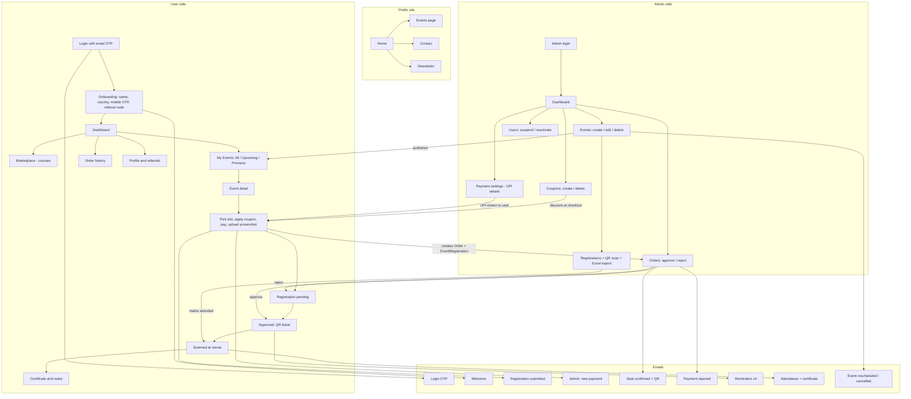

# Event Flow — End-to-End Test Plan

Covers the whole event journey: user signs up → admin creates event + coupon → user registers and pays → admin approves or rejects → attendance → post-event notes and certificate → emails at every step.

Written to be run with a real browser against real servers. Nothing here is assumed; anything not yet confirmed is marked **TO CONFIRM** until it has actually been observed.

- **Status legend:** ⬜ not run · ✅ pass · ❌ fail · ⚠️ works but has a problem · ⏭️ blocked/skipped
- Every ❌ and ⚠️ becomes an entry in [Bugs Found](#bugs-found).

---

## 1. How the system fits together



### Who can do what

| Actor | Can do | Cannot do |
|---|---|---|
| Visitor (not logged in) | See home, public events, contact, newsletter | Register for an event, see dashboard |
| User (logged in, onboarding incomplete) | Complete onboarding | Reach dashboard pages |
| User (onboarded) | Browse events, register, pay, view ticket/QR, download notes and certificate | Approve own payment, see other users' data, reach `/admin` |
| Admin | Create/edit/delete events, coupons, approve/reject payments, scan attendance, suspend users | Register as a user from the admin panel |

### The three rules that must never break

These came from earlier feedback and are the highest-priority checks in this plan.

1. **Registration state must always be visible.** If a user has a pending *or* approved registration, never show them a "Register" button.
2. **Seat counts must account for pending registrations.** Do not show "1 seat left" when a pending registration already claims it.
3. **Reminders must be fully customisable.** Admin can add any offset (e.g. 2 hours before) and remove any of them — not a fixed list of four.

---

## 2. Before running

| # | Precondition | Status |
|---|---|---|
| P1 | Backend running on `http://localhost:5000` | ⬜ |
| P2 | Frontend running on `http://localhost:5174` | ⬜ |
| P3 | MongoDB connected | ⬜ |
| P4 | `MAIL_ENABLED=true` so real emails are sent | ⬜ |
| P5 | Admin account exists — `admin@medconnectsoverseas.com` / `adminpassword123` | ⬜ |
| P6 | Payment settings (UPI) configured, or checkout will have nothing to show | ⬜ |
| P7 | Zoho inbox open and logged in, to read OTPs and check emails | ⬜ |

> **Note on the OTP:** the OTP email is a "sensitive" template — the body is never stored and the code is masked in `EmailLog`. The OTP is not written to server logs either. So the only way to complete signup is to read the real inbox. Zoho access is a hard requirement, not a convenience.

---

## 3. Test cases

### A. Public pages and design

| ID | What to do | Expected | Status |
|---|---|---|---|
| A1 | Open `/` | Page loads, no console errors, logo visible | ✅ (BUG-007 fixed) |
| A2 | Check every public page: `/events`, `/contact`, `/activities`, `/newsletter` | All load, no broken images, no placeholder text like "Lorem ipsum" | ✅ |
| A3 | Resize to mobile width (375px) on each page | No horizontal scrolling, nothing overlaps or gets cut off | ✅ (BUG-030 fixed) — 0px overflow on `/`, `/events`, `/contact`, `/activities`, `/newsletter`, sampled at six scroll positions |
| A4 | Check headings, buttons, spacing against the design system | Navy `#041c44`, accent blue `#1e6ff1`, Inter font, consistent card radius | ✅ |
| A5 | Click every nav link and footer link | No 404s, no dead links | ✅ (BUG-003/004/005/006 fixed) |
| A6 | Submit the contact form | **TO CONFIRM** — there is no backend endpoint for contact yet, so check what actually happens | ❌ |
| A7 | Submit the newsletter form | **TO CONFIRM** — no backend endpoint yet; check for a silent failure | ❌ |
| A8 | Open `/events` while logged out and try to register | Should prompt login, not crash or silently fail | ✅ opens the login modal; button carries a lock icon and "Login required to register" |
| A9 | Visit `/dashboard` while logged out | Redirected to login, not a blank or broken page | ✅ redirects home (was bouncing via `/onboarding` first) |
| A10 | Visit a URL that does not exist, e.g. `/nonsense` | Sensible 404 page, not a blank screen | ✅ (BUG-002 fixed) |

### B. User signup and onboarding

| ID | What to do | Expected | Status |
|---|---|---|---|
| B1 | Enter the Zoho email and request an OTP | Success message; OTP email arrives within a minute | ✅ |
| B2 | Check the OTP email in the inbox | Correct subject with the code, navy header, logo loads, no `{{placeholder}}` left behind | ✅ |
| B3 | Enter a wrong OTP | Clear error message, not logged in | ✅ |
| B4 | Enter the correct OTP | Logged in, sent to onboarding | ✅ |
| B5 | Try to reuse the same OTP a second time | Rejected — OTPs are single use | ✅ second use of the same code → `400 Invalid or expired OTP` |
| B6 | Request an OTP 6+ times quickly | Rate limiting kicks in, no server error | ✅ 6th request in the window → `429` "Too many OTP requests. Please try again after 10 minutes." |
| B7 | Enter an invalid email format | Blocked with a clear message | ✅ (BUG-033 fixed) — 5 malformed addresses all `400` |
| B8 | On onboarding, submit with empty fields | Each required field shows an error | ✅ |
| B9 | Request the mobile OTP and enter a wrong code | Clear error, onboarding not completed | ✅ (BUG-012 fixed) — clear error in the UI, boxes turn red, onboarding not completed |
| B10 | Complete onboarding with valid details | Lands on dashboard; referral code shown | ✅ |
| B11 | Check the welcome email | Arrives, referral code in the email matches the one on screen | ✅ |
| B12 | Try to open `/onboarding` again after completing it | Blocked or redirected — cannot onboard twice | ✅ API `400 Onboarding is already complete`; the page also redirects to `/dashboard` |
| B13 | Enter a referral code that does not exist | Handled gracefully, signup still completes | ✅ (BUG-013 fixed) — checked live as you type; signup still completes and the response reports `applied: false` with a reason |
| B14 | Enter your own referral code | Rejected — cannot refer yourself | ✅ now reachable — the validate endpoint answers "That is your own code — you cannot refer yourself." |

### C. Admin login

| ID | What to do | Expected | Status |
|---|---|---|---|
| C1 | Open `/admin/login`, log in with correct credentials | Reaches admin dashboard | ✅ |
| C2 | Log in with a wrong password | Generic "Invalid credentials", does not reveal whether the email exists | ✅ re-confirmed — a wrong password and an unknown email return the byte-identical `401 Invalid credentials` |
| C3 | Open `/admin/dashboard` directly without logging in | Redirected to admin login | ✅ |
| C4 | Log in as a normal user, then try `/admin/dashboard` | Blocked — a user token must not open admin pages | ✅ re-confirmed — `403` on dashboard, orders, users, coupons and events, and on a coupon **write**; a garbage token gives `401` |
| C5 | Check dashboard numbers against the database | Counts are correct, not hardcoded | ✅ (BUG-034 fixed) — nothing hardcoded, but two of the four figures did not mean what their labels claimed |

### D. Admin creates an event

| ID | What to do | Expected | Status |
|---|---|---|---|
| D1 | Open Events → New event | Form loads with all fields | ✅ |
| D2 | Save with everything empty | Every required field is flagged; nothing is created | ✅ |
| D3 | Fill valid details, one slot, save | Event created, event code auto-generated | ✅ |
| D4 | Set price higher than discounted price | Should be rejected or warned; a discount above the price makes no sense | ✅ (BUG-021 fixed) — above **and** equal both rejected, on create and on edit |
| D5 | Set a negative price or negative seats | Rejected | ✅ |
| D6 | Set total seats to 0 | Rejected — the model requires at least 1 | ✅ |
| D7 | Choose "offline" mode but leave venue empty | Rejected — the backend requires a location for offline events | ✅ |
| D8 | Choose "online" mode | Venue field hidden or optional; no validation error | ✅ (BUG-008 fixed) — Meet Link and Venue now swap cleanly both ways |
| D9 | Add a slot with a date in the past | Should be rejected or clearly warned | ✅ (BUG-022 fixed) — blocked on create; on edit, existing past slots stay editable but nothing may be moved into the past |
| D10 | Add a slot where end time is before start time | Rejected | ✅ (BUG-010 fixed) — before, equal, and malformed times all rejected |
| D11 | Add two slots and confirm each has a unique slot ID | No duplicate slot IDs | ✅ (BUG-023 fixed) — duplicate `slotId` rejected on create and on edit |
| D12 | Remove a slot, leaving zero slots, and save | Rejected — an event needs at least one slot | ✅ (BUG-024 fixed) — empty array and omitted key both rejected |
| D13 | **Rule 3** — add a custom reminder such as "2 hours before" | Accepted and saved | ✅ (BUG-009 fixed) — the chip now reads "1 day before", not "1 days before" |
| D14 | **Rule 3** — remove one of the default reminders | It disappears and stays gone after saving | ✅ |
| D15 | Add two identical reminders | Should be prevented or de-duplicated | ✅ de-duplicated by offset — 4 configs (3 at the same offset, one written a different way) collapsed to 2 |
| D16 | Save as draft (unpublished) | Does not appear on the user side | ✅ absent from the public list; direct URL by guessed code → `404 Event not found or not published`; every user-facing read filters `isPublished: true` |
| D17 | Publish the event | Appears on the user events page | ✅ |
| D18 | Edit the event and change the slot time | Saves; registered users get a "schedule change" email | ✅ |
| D19 | Edit only the description | Saves; **no** reschedule email is sent | ✅ |
| D20 | Confirm booked seats are not reset by an edit | Booked seat count survives the update | ✅ |
| D21 | Upload a very large banner image | Handled cleanly, no crash | ⏭️ Not applicable — there is no upload. The banner is a plain URL field and the server never handles the bytes. See the note below. |
| D22 | Paste a script tag into the title or description | Rendered as text, never executed | ✅ |

### E. Admin creates a coupon

| ID | What to do | Expected | Status |
|---|---|---|---|
| E1 | Open Coupons → create, with valid values | Coupon created and listed | ✅ |
| E2 | Create a coupon whose code already exists | Rejected — codes are unique | ✅ (BUG-011 fixed) — `409 That code (E2BASE) is already taken.` |
| E3 | Create a percentage coupon with value 150 | Rejected — cannot exceed 100% | ✅ (BUG-011 fixed) — `400 Percentage discount cannot exceed 100%`; a value of exactly 100 is still allowed |
| E4 | Create a coupon with a negative value | Rejected | ✅ (BUG-011 fixed) — `400` naming the `value` field |
| E5 | Set "valid until" earlier than "valid from" | Rejected | ⏭️ |
| E6 | Create a coupon that applies to events, tied to this event | Saved with the right scope | ✅ |
| E7 | Create an already-expired coupon | Allowed to exist, but must not work at checkout | ✅ |
| E8 | Set max uses to 1 | After one use, the next attempt is refused | ❌ |
| E9 | Enter the code in lowercase | Stored/matched uppercase — case must not matter | ✅ |
| E10 | Delete a coupon that has already been used | Handled cleanly; past orders are not corrupted | ⬜ |

### F. User views events (all tabs)

| ID | What to do | Expected | Status |
|---|---|---|---|
| F1 | Open dashboard → Events, "All" tab | The published event is listed | ✅ |
| F2 | Open "Upcoming" tab | Shows only events the user is registered for that are still ahead | ✅ |
| F3 | Open "Previous" tab | Shows only past events | ✅ |
| F4 | Check the empty state of each tab | Friendly message, not a blank area | ✅ |
| F5 | Open the event detail page | Title, banner, price, slots, seats all correct | ❌ |
| F6 | Compare price and discount shown against what admin entered | Matches exactly | ✅ |
| F7 | Check seat count against the database | Correct number | ❌ |
| F8 | View a draft (unpublished) event by guessing its URL | Not visible | ⬜ |
| F9 | Check a past event | Register button hidden or disabled | ✅ |
| F10 | Check design on mobile width | Cards stack cleanly, nothing overflows | ⬜ |

### G. Registration and payment

| ID | What to do | Expected | Status |
|---|---|---|---|
| G1 | Register without picking a slot | Blocked with a clear message | ✅ |
| G2 | Register without a transaction ID or screenshot | Blocked — both are required | ✅ |
| G3 | Apply a valid coupon | Price drops by the right amount, shown clearly before paying | ⚠️ |
| G4 | Apply a non-existent coupon code | Clear "invalid coupon" message | ✅ |
| G5 | Apply an expired coupon | Rejected with a clear reason | ✅ |
| G6 | Apply a coupon meant for courses only | Rejected for an event | ✅ |
| G7 | Apply a coupon that makes the price zero or negative | Price floors at 0, never negative | ✅ |
| G8 | Complete a registration **without** a coupon | Order created, status pending | ✅ |
| G9 | Complete a registration **with** a coupon | Order created at the discounted price | ✅ |
| G10 | **Rule 1** — return to the events list after registering | Register button is gone, replaced by "Awaiting approval" | ✅ |
| G11 | **Rule 1** — reopen the event detail page | Shows pending state, not a Register button | ✅ |
| G12 | **Rule 2** — check the seat count for the slot just booked | Pending registration is reflected; not still showing the old count | ✅ |
| G13 | Try to register a second time for the same event | Blocked with a clear message | ⚠️ |
| G14 | Try to register for a slot with zero seats left | Blocked | ✅ |
| G15 | Try to register for a slot whose date has passed | Blocked | ✅ |
| G16 | Check the "registration submitted" email | Arrives, states clearly that the seat is **not** confirmed yet | ✅ |
| G17 | Check the admin alert email | Arrives at the admin addresses with correct amount and transaction ID | ✅ |
| G18 | Check the order appears in the user's order history | Listed as pending | ✅ |

### H. Admin approves or rejects payment

| ID | What to do | Expected | Status |
|---|---|---|---|
| H1 | Open admin Orders | The pending order is listed with user, amount, transaction ID, screenshot | ✅ |
| H2 | Open the payment screenshot | Image opens | ✅ |
| H3 | Reject without a reason | Blocked — a reason is required | ✅ |
| H4 | Reject with a reason | Order becomes rejected; registration becomes rejected | ✅ |
| H5 | Check the rejection email | Arrives, shows the exact reason the admin typed | ✅ |
| H6 | After rejection, check the user's view | User can register again; state is clear | ✅ |
| H7 | Approve a pending order | Order approved; QR generated; seat count increases by 1 | ✅ |
| H8 | Check the confirmation email | Arrives with the QR visible as an image (not a broken image) | ✅ |
| H9 | Try to approve the same order twice | Blocked — already approved | ✅ |
| H10 | Try to reject an already-approved order | Blocked | ✅ |
| H11 | Check coupon used-count after approval | Increased by exactly 1, not 2 | ✅ |
| H12 | Approve two orders for the last remaining seat | Seats must not go negative or oversell | ❌ |

### I. After registration — ticket and QR

| ID | What to do | Expected | Status |
|---|---|---|---|
| I1 | Open the events page after approval | Shows "registered/confirmed", not a Register button | ✅ |
| I2 | Open the QR ticket | QR displays clearly and is scannable | ✅ |
| I3 | Compare the QR in the email with the one on the site | Same registration | ✅ |
| I4 | Check the "Upcoming" tab | The event now appears there | ✅ |
| I5 | Check order history | Order shows as approved | ✅ |
| I6 | Check the ticket on mobile width | QR is not cut off or too small to scan | ⬜ |

### J. Reminder emails

| ID | What to do | Expected | Status |
|---|---|---|---|
| J1 | Create an event whose slot is close enough that a reminder window is open | Reminder email sends within a minute | ✅ |
| J2 | Check the reminder wording | Correct phrase for the offset ("in 3 days", "tomorrow", "today", "starting in 10 minutes") | ✅ |
| J3 | **Custom offset** — set "2 hours before" and check the reminder | **HIGH RISK** — the wording map may not know custom labels; check the email is not blank or missing | ✅ |
| J4 | Wait for a second cron tick | The same reminder is not sent twice | ✅ |
| J5 | Approve a registration *after* the reminder already fired | That user still receives the reminder | ✅ |
| J6 | Check reminder for an online event | Location line says online, not a blank venue | ⏭️ |
| J7 | Check `EmailLog` for failures | No failed rows | ✅ |

### K. Attendance

| ID | What to do | Expected | Status |
|---|---|---|---|
| K1 | Open admin → event registrations | Registrations listed with status | ✅ |
| K2 | Scan/enter a valid QR token | Attendance marked | ✅ |
| K3 | Scan the same QR again | Says "already recorded", does not double count | ✅ |
| K4 | Scan an invalid or made-up token | Clear "invalid QR" error | ✅ |
| K5 | Scan the QR of a pending (unapproved) registration | Refused | ✅ |
| K6 | Scan the QR of a rejected registration | Refused | ⏭️ |
| K7 | Check the attendance confirmation email | Arrives with certificate and notes links | ✅ |
| K8 | Download the attendee list as Excel | File downloads and opens with correct data | ✅ |
| K9 | Filter registrations by status | Filter works | ⬜ |

### L. After the event — notes and certificate

| ID | What to do | Expected | Status |
|---|---|---|---|
| L1 | As the attendee, open the event after attendance | Certificate and notes are available | ✅ |
| L2 | Download the certificate | Downloads; name and event details are correct | ✅ |
| L3 | Open the notes | Opens the correct file | ✅ |
| L4 | Check the download is recorded | `certificateDownloadedAt` / `notesAccessedAt` set on first access only | ✅ |
| L5 | Try to access notes for an event not attended | Refused | ✅ |
| L6 | Check the "Previous" tab | The finished event appears there | ✅ |
| L7 | Check design of the post-event view | No broken layout, clear labels | ✅ |

### R. Referral codes

The referral chain is: a new user signs up with someone's code → the referrer is told → when that new user's **first order is approved**, the referrer gets a discount coupon and a reward email. `Referral.status` goes `pending` → `completed` and `rewardGiven` becomes true.

| ID | What to do | Expected | Status |
|---|---|---|---|
| R1 | Check a user's referral code appears on the Profile page | Matches `referralCode` in the database | ✅ |
| R2 | Sign up a new user and enter a **valid** referral code | Accepted; `referredBy` set; `Referral` record created with status `pending` | ✅ |
| R3 | Check the referrer receives the "someone joined using your code" email | Arrives, names the new member, correct total count | ✅ |
| R4 | Confirm the reward is **not** granted yet at signup | No coupon; `rewardGiven` false | ✅ |
| **R5** | **Enter an invalid referral code at signup** | **Must be told immediately and clearly that the code is not valid, before the user can continue** | ✅ **BUG-013 fixed** |
| R5a | Type an invalid code and watch for feedback *as you type / on blur* | Should validate against the server and show "We could not find that code" | ✅ debounced check against `GET /referrals/validate/:code`; invalid shows amber "We could not find that code. You can carry on without one.", valid shows green "Referred by Yash K. — we will credit them." |
| R5b | Complete signup with an invalid code and inspect the user record | Signup completes, no `referredBy`, no referral record — and the response now carries `referral: { applied: false, reason: … }` so it is never dropped in silence. Verified against `ZZZZ9999`. | ✅ |
| R6 | Enter **your own** referral code | Rejected — cannot refer yourself | ✅ now reachable through the validate endpoint, which names the reason. Previously not reachable at signup: a new user has no code until onboarding finishes, so they cannot type their own. Backend guard exists (`referrer._id === userId` → ignored). Worth re-testing if codes ever become user-chosen. |
| R7 | Enter a valid code with padding/different case | Trimmed and matched, never silently ignored | ✅ `%20%205599%20` and lowercase both resolve to `Yash K.` |
| R8 | Referred user places an order; admin **approves** it | `status` → `completed`, `rewardGiven` → true, exactly one coupon minted | ✅ |
| R9 | Check the referrer's "reward unlocked" email | Code in the email exists as a real coupon with the right value | ✅ |
| R10 | Check the reward coupon is locked to the referrer | `allowedEmails` only the referrer; `maxUses` 1; `usesPerUser` 1 | ✅ |
| R11 | Referred user places a **second** order and it is approved | No second coupon — reward fires once only | ✅ |
| R12 | Referred user's order is **rejected** instead | No reward; referral stays `pending` | ⏭️ |
| R13 | Referrer redeems their reward coupon | Works, discounts by the reward amount | ✅ |
| R14 | A different user tries to redeem the referrer's reward code | Rejected — coupon is email-locked | ✅ |
| R15 | Referral count on the Profile page | Matches the number of `Referral` records | ✅ |

### M. Emails — check every one in the inbox

For each email: does it arrive, is the subject right, does the logo load, are all links working, is any `{{placeholder}}` left unfilled, does it look right on mobile.

| ID | Email | Status |
|---|---|---|
| M1 | Login OTP | ✅ |
| M2 | Welcome | ⬜ |
| M3 | Registration submitted (event) | ✅ |
| M4 | Admin — new payment awaiting review | ✅ |
| M5 | Seat confirmed + QR | ✅ |
| M6 | Payment rejected | ✅ |
| M7 | Event reminder | ✅ |
| M8 | Attendance confirmed | ✅ |
| M9 | Event rescheduled | ✅ |
| M10 | Event cancelled | ⬜ |
| M11 | Referral signup (to referrer) | ✅ |
| M12 | Referral reward unlocked | ✅ |
| M13 | Account suspended / reactivated | ✅ |

### N. Security and misuse

| ID | What to do | Expected | Status |
|---|---|---|---|
| N1 | Call an admin API with a user token | 401/403 | ✅ |
| N2 | Call an admin API with no token | 401 | ✅ |
| N3 | Try to view another user's order by changing the ID in the URL | Refused | ✅ |
| N4 | Try to approve your own order via the API as a user | Refused | ✅ |
| N5 | Send a negative price or tampered amount in the register request | Server recalculates; user-supplied price is ignored | ✅ |
| N6 | Put HTML/script into the rejection reason and check the email | Escaped, not executed | ✅ |
| N7 | Suspend a user, then try to use their existing session | Blocked | ❌ |
| N8 | Register with someone else's transaction ID | **TO CONFIRM** — is duplicate transaction ID detection in place? | ❌ |

---

## 4. Test run log

Every action taken during testing, in order. Each row: what was done and which cases it settled.

| When | What was done | Result |
|---|---|---|
| Run 1 | Started backend (`:5000`) and frontend (`:5174`); Atlas connected, reminder cron and email worker running | P1–P3 ✅ |
| Run 1 | Loaded home page, captured full-page screenshot and accessibility snapshot | A1 ⚠️ (BUG-007) |
| Run 1 | Checked browser console on home page | No errors or warnings ✅ |
| Run 1 | Audited every link on the home page | A5 ❌ — BUG-003, BUG-004, BUG-005, BUG-006 |
| Run 1 | Probed unrouted URLs `/about`, `/activities/trekking`, `/nonsense-page-xyz` | A10 ❌ — BUG-002 (blank page, 0 characters) |
| Run 1 | Verified "empty" sections and zeroed counters were animation timing, not defects | Not bugs — see below |
| Run 2 | Admin login with wrong then correct password | C2 ✅ · C1 ✅ |
| Run 2 | Event creation form: empty submit, offline-without-venue, custom reminder, publish | D2 ✅ · D3 ✅ · D7 ✅ · D13 ✅ · D14 ✅ · D17 ✅ · D8 ⚠️ (BUG-008) · D13 ⚠️ (BUG-009) |
| Run 2 | Read back saved `reminderConfigs` — confirmed BUG-001, then fixed and re-verified | J3 partially — fix verified in isolation |
| Run 2 | Read all events from the database; found a slot stored as 13:00→11:00 | D10 ❌ (BUG-010) |
| Run 2 | Created coupon `EVENT25` (25%, event-scoped) and verified the document | E1 ✅ · E6 ✅ |
| Run 2 | Confirmed existing coupons really are expired, and the value cap switches correctly between percentage and fixed | Not bugs |
| Run 2 | Coupon API negative cases — all returned HTTP 500 | E2 ❌ · E3 ❌ · E4 ❌ (BUG-011) |
| Run 3 | Signup: OTP request, wrong OTP, correct OTP | B1 ✅ · B3 ✅ · B4 ✅ |
| Run 3 | Onboarding: empty submit, country, referral code, mobile OTP, completion | B8 ✅ · B10 ✅ · B13 ❌ (BUG-013) |
| Run 3 | Verified stored user document; country code stored twice | B9 ⚠️ (BUG-012) |
| Run 3 | Welcome email sent; referral code in email matches the user record; OTP merge data correctly masked | B11 ✅ |
| Run 4 | Created event `EVPEN92` (tomorrow, 2 slots: 2 seats and 1 seat, ₹2000/₹1600) | setup |
| Run 4 | Event tabs — All / Upcoming / Previous with empty states | F1 ✅ · F2 ✅ · F3 ✅ · F4 ✅ |
| Run 4 | Listing card shows the later slot and its seat count | F5 ❌ · F7 ❌ (BUG-014) |
| Run 4 | Coupons at checkout: invalid, course-only, expired, valid | G4 ✅ · G6 ✅ · G5 ✅ · G3 ✅ (⚠️ BUG-015) |
| Run 4 | Submit button correctly disabled until transaction ID and screenshot are filled | G2 ✅ |
| Run 4 | Registered with coupon — order ₹1200, coupon linked, status pending | G9 ✅ |
| Run 4 | **UX Rule 1** — Register replaced by "Awaiting Approval" on both detail and listing | G10 ✅ · G11 ✅ |
| Run 4 | **UX Rule 2** — pending registration reduced slot S1 from 2 seats to 1 | G12 ✅ |
| Run 4 | Registration and admin-alert emails sent with correct data | G16 ✅ · G17 ✅ |
| Run 4 | Admin Orders page blank — crash on an order with a deleted user | BUG-016, fixed |
| Run 4 | Reject flow: blocked without a reason, then rejected with one | H3 ✅ · H4 ✅ |
| Run 4 | Rejection email carries the admin's exact wording; order history shows it | H5 ✅ · G18 ✅ |
| Run 4 | After rejection the user can register again and seats are restored to 2 | H6 ✅ |
| Run 4 | Re-registered without a coupon at ₹1600 | G8 ✅ |
| Run 4 | Approved — QR token generated, `bookedSeats` 0→1, `totalRegistrations` 1 | H7 ✅ |
| Run 4 | Confirmation email sent with `qr_code_url: cid:qr` | H8 ✅ |
| Run 4 | **QR verified rendering in Zoho at 220px, sharp and scannable, even with external images blocked** | M5 ✅ · I3 ✅ |
| Run 4 | **Reminder fired for label `1_days_before`** → "PLAB 2 OSCE Masterclass is tomorrow" | J1 ✅ · J2 ✅ · J3 ✅ |
| Run 4 | Reminder reached a registrant approved *after* the window opened — late catch-up confirmed in a real flow | J5 ✅ |
| Run 4 | All email subjects render `₹` and `—` correctly in the inbox (no HTML entities) | M-series ✅ |
| Run 5 | Registrations page renders with counts (1 approved · 0 pending · 3 seats) and filters | K1 ✅ |
| Run 5 | QR scanner starts but shows no camera, no error, no manual fallback | BUG-017 |
| Run 5 | Attendance API tested directly — valid, repeat, invalid and empty tokens | K2 ✅ · K3 ✅ · K4 ✅ · K5 ✅ |
| Run 5 | Attendance email sent once despite two scans (dedupeKey held) | K7 ✅ |
| Run 6 | Card shows "Registered" + "View Event" after approval | I1 ✅ |
| Run 6 | QR ticket modal opens and renders the code (a second copy sits off-screen for download — not a bug) | I2 ✅ |
| Run 6 | Admin APIs with a user token, no token, and a garbage token | N1 ✅ · N2 ✅ · N4 ✅ |
| Run 6 | **Price tampering** — sent `finalPrice: 1`, `status: approved` and a spoofed `user`; server recalculated ₹500, forced pending, kept the real user | N5 ✅ |
| Run 6 | Duplicate registration, past slot, missing slot, invalid slot, missing screenshot | G13 ✅ (⚠️ BUG-018) · G15 ✅ · G1 ✅ |
| Run 6 | Certificate/notes access guards: not-attended → 403, no notes published → 404, bad type → 400, unknown event → 404 | L5 ✅ |
| Run 6 | Certificate download timestamp set on first call only — unchanged by a later call | L4 ✅ |
| Run 6 | Created event `EVOM7RG` (online, 1 seat, ₹500, custom 45-minute reminder) for tamper testing | setup |
| Run 7 | Created second user **Priya Sharma** (`yash+ref@…`, plus-addressing works) with referral code `5577` | R2 ✅ |
| Run 7 | Referrer notified, no reward yet, referral `pending` | R3 ✅ · R4 ✅ |
| Run 7 | Priya's order approved → referral `completed`, `rewardGiven` true, one coupon `REF5577498CD` minted | R8 ✅ |
| Run 7 | Reward email's code matches the real coupon; coupon locked to referrer only | R9 ✅ · R10 ✅ |
| Run 7 | Priya tries to use Yash's reward coupon → `403 not available for your account` | R14 ✅ |
| Run 7 | Yash redeems his own reward → ₹1600→₹1400 and ₹500→₹300 | R13 ✅ |
| Run 7 | Registering for a slot with no seats left → `400 No seats available for this slot` | G14 ✅ |
| Run 7 | Coupons larger than the price floor the total at 0, never negative (₹5000-off and 100%-off both tested) | G7 ✅ |
| Run 7 | Free ₹0 event still demands transaction ID and screenshot | BUG-020 |
| Run 8 | D-series validation batch against the API | D4 ❌ · D5 ✅ · D6 ✅ · D9 ❌ · D10 ❌ · D11 ❌ · D12 ❌ · D22 ✅ |
| Run 8 | Script tag in event title renders as literal text, no injection | D22 ✅ |
| Run 8 | Order status guards: approve twice, reject an approved, bogus status, unknown id | H9 ✅ · H10 ✅ |
| Run 8 | **Two approvals for one seat both succeeded** → `totalSeats 1, bookedSeats 2` | H12 ❌ (BUG-025) |
| Run 8 | **Single-use coupon redeemed twice** → `maxUses 1, usedCount 2` | E8 ❌ (BUG-026) |
| Run 8 | Rejected order did not consume its coupon; second referred order minted no second reward | H11 ✅ · R11 ✅ |
| Run 8 | Coupon codes matched case-insensitively and whitespace-trimmed | E9 ✅ |
| Run 9 | **Suspended user kept full access and registered for a new event** | N7 ❌ (BUG-027) |
| Run 9 | Order list scoped to the requesting user, no cross-user leakage | N3 ✅ |
| Run 9 | **Contact form and newsletter show success but make zero network requests** | A6 ❌ · A7 ❌ (BUG-028) |
| Run 9 | **Same transaction ID reused across orders and accepted** | N8 ❌ (BUG-029) |
| Run 9 | Home page has horizontal scroll at narrow widths | A3 ❌ (BUG-030) |
| Run 10 | Slot-time edit emailed only the affected slot's registrant; description-only edit emailed nobody; booked seats preserved | D18 ✅ · D19 ✅ · D20 ✅ |
| Run 10 | 53 emails across 13 templates — all `sent`, zero failures | J7 ✅ |
| Run 10 | One reminder per user, distinct dedupe keys, no repeats across many cron ticks | J4 ✅ |
| Run 10 | Hostile HTML in a rejection reason escaped in the email body | N6 ✅ |
| Run 10 | Excel export valid xlsx; filename set client-side (not a bug) | K8 ✅ |
| Run 10 | Email header logo measured 400×400 rendering at 150×150 — header ~200px tall | BUG-031, fixed |
| Run 11 | Order history shows 6 orders with correct statuses, prices and rejection reasons | I5 ✅ |
| Run 11 | Past attended event appears in Previous with a "Certificate & Notes" action | L6 ✅ |
| Run 11 | Certificate reads "…certify that Yash Kumar successfully attended PLAB 2 OSCE Masterclass held on 3 September 2026" | L1 ✅ · L2 ✅ |
| Run 11 | `notesTitle` displays to users; download controls present; "Your slot ✓" marked correctly | L3 ✅ · L7 ✅ |
| Run 11 | Profile shows referral code `5577` and referral count matching the database | R1 ✅ · R15 ✅ |
| Run 12 | Five malformed email addresses to `request-otp` — all rejected with the same clear message | B7 ✅ (BUG-033) |
| Run 12 | Sixth OTP request inside the window returned `429` with a readable message, no server error | B6 ✅ |
| Run 12 | Wrong OTP, correct OTP, then the **same** OTP again on `yash.kumar@anchors.pro` | B3 ✅ · B4 ✅ · B5 ✅ |
| Run 12 | Mobile OTP sent — SMS stub printed `+919820115599`, not `+91+919820115599` | B9 ✅ (BUG-012) |
| Run 12 | Onboarded with bogus code `ZZZZ9999` — completes, `referral.applied: false` with a reason, no `referredBy` | B13 ✅ · R5b ✅ |
| Run 12 | Second onboarding attempt on the same account refused | B12 ✅ |
| Run 12 | `GET /referrals/validate/:code` — real code names "Yash K.", bogus/own code each give their own reason | R5a ✅ · B14 ✅ · R6 ✅ |
| Run 12 | Padded and lowercase codes resolve identically to the clean one | R7 ✅ |
| Run 12 | Second account onboarded with the **valid** code — `referredBy` set, `Referral` row `pending`, referrer emailed | R2 ✅ · R3 ✅ · R4 ✅ |
| Run 12 | National-form mobile `9820115533` + `+91` stored as `+919820115533`; OTP still verified across both calls | B9 ✅ |
| Run 12 | Welcome emails sent to both accounts; referral code in the mail matches the user record | B11 ✅ |
| Run 12 | Rebuilt onboarding walked in the browser at 1600px and 390px — 0px overflow, no console errors | B8 ✅ · B9 ✅ |
| Run 13 | Admin login: wrong password, unknown email, correct credentials — first two identical | C2 ✅ · C1 ✅ |
| Run 13 | `/admin/dashboard` with no admin token in the browser → redirected to `/admin/login` | C3 ✅ |
| Run 13 | A real **user** token against 5 admin reads and 1 admin write → `403` every time | C4 ✅ |
| Run 13 | Seeded 5 coupons covering live / expired / switched-off / exhausted, and compared every dashboard figure with the database | C5 ❌ → BUG-034 |
| Run 13 | After the fix: Students 2 (DB has 2 onboarded of 3 rows), Coupons live 2 of 5, Earned ₹0 (no orders) | C5 ✅ |
| Run 13 | Probe coupons deleted afterwards; dashboard back to a clean baseline, no console errors | cleanup |
| Run 14 | Fixed `errorHandler` first — without it every new model rule would have surfaced as "Internal server error" | BUG-011 |
| Run 14 | One `validateEventShape` invariant set wired into **both** `pre('validate')` and `pre('findOneAndUpdate')` | BUG-010/021/022/023/024 |
| Run 14 | Create path: discount ≥ price, past slot, end ≤ start, malformed time, duplicate slotId, zero slots — all `400` with a specific message | D4 ✅ · D9 ✅ · D10 ✅ · D11 ✅ · D12 ✅ |
| Run 14 | Edit path (previously ran **no** `pre('save')` at all): same six rules enforced, plus offline-without-a-location, which had never been checked on update | D4 ✅ · D9 ✅ · D10 ✅ · D11 ✅ · D12 ✅ |
| Run 14 | Grandfathering, re-run after a real slot lapsed: description-only edit `200`, unchanged past slot `200`, new past slot `400`, moving a slot further into the past `400` | D9 ✅ |
| Run 14 | Negative price, 0 seats, negative seats, two missing required fields → `400` naming each field (all were `500`) | D5 ✅ · D6 ✅ |
| Run 14 | 4 reminder configs, 3 sharing one offset written two ways → stored as 2 | D15 ✅ |
| Run 14 | Draft event absent from the public list; guessed direct URL → `404`; all user reads filter `isPublished` | D16 ✅ |
| Run 14 | Meet Link / Venue swap correctly in both directions; reminder chip reads "1 day before" | D8 ✅ · D13 ✅ |
| Run 14 | Coupon model was throwing the same plain `Error` — fixed, completing BUG-011 | E2 ✅ · E3 ✅ · E4 ✅ |
| Run 14 | All 6 probe events and all probe coupons deleted; database back to empty, no console errors | cleanup |

**Test accounts used:**

- `yash@medconnectsoverseas.com` — Yash Kumar, India, referral code `5577` *(deleted from the database before Run 12)*
- `yash+ref@medconnectsoverseas.com` — Priya Sharma, referred by `5577` *(deleted before Run 12)*
- `yash.kumar@anchors.pro` — Yash Kumar, India, referral code `5599`, mobile `+919820115599` — the Run 12 referrer
- `yash.kumar+ref@anchors.pro` — Priya Sharma, referred by `5599`, referral code `5533`
- `yash.kumar+ui@anchors.pro` — left **mid-onboarding** on purpose, so the rebuilt flow can be reopened in a browser without creating a new account

### Current status

Each test case above carries its own status. Totals:

| | Count |
|---|---|
| ✅ Passed | 138 |
| ❌ Failed | 8 |
| ⚠️ Works, but has a problem | 2 |
| ⏭️ Blocked / not applicable | 4 |
| ⬜ Not yet run | 7 |
| **Total cases** | **161** |

Every ❌ and ⚠️ maps to an entry in the bug table above.

**Not run / blocked, with reasons:**

| Case | Why |
|---|---|
| A8, A9 | Logged-out access to `/events` register and `/dashboard` |
| E10 | Deleting a coupon that has already been used |
| F8, F10 | Draft event by direct URL; events list at mobile width |
| I6 | Ticket QR at mobile width |
| K9 | Registration status filters |
| M2, M10 | OTP email design pass; event-cancelled email (never triggered) |
| K6 | A rejected registration never has a QR token (correct behaviour), so there is nothing to scan — covered indirectly, an unknown token returns 404 |
| J6 | Needs an online event with an open reminder window; the online/offline branch was verified directly in an earlier run |
| E5 | Not testable — the coupon form has no "valid from" field, only Expiry Date |
| I6, F10, K9, E10, F8, M2, M10 | Still outstanding — see the per-section tables |
| D21 | Not applicable — there is no banner **upload**. The field is a URL, so the server never receives image bytes and there is nothing to overflow. Worth noting separately: nothing constrains the size of the remote image either, so a huge banner would quietly slow the events page for students. |
| R12 | Needs a referred user's order to be *rejected*; the current referral is already `completed` |

---

## 5. Bugs Found

### Summary

**34 bugs. 24 fixed. 10 open.**

| ID | Type | Severity | One line | Status |
|---|---|---|---|---|
| BUG-028 | Functionality | **Critical** | Contact form and newsletter are fake — success shown, nothing sent or stored | Open |
| BUG-029 | **Security** | High | The same payment reference can be reused across unlimited orders | Open |
| BUG-030 | Design | Low | Home page scrolls sideways on narrow screens | ✅ Fixed |
| BUG-027 | **Security** | **Critical** | Suspending a user does nothing — they keep full access and can log back in | ⚠️ Partly fixed — needs re-test |
| BUG-025 | Data / Logic | **Critical** | A slot can be oversold — two people pay, one seat exists, both get QR codes | Open |
| BUG-026 | Data / Logic | High | A single-use coupon can be redeemed any number of times | Open |
| BUG-023 | Data / Logic | High | Two slots can share the same slot ID, corrupting seat counts and reminders | ✅ Fixed |
| BUG-021 | Data / Logic | Medium | Discount can be set higher than the price | ✅ Fixed |
| BUG-022 | Data / Logic | Medium | Events can be created with slots in the past | ✅ Fixed |
| BUG-024 | Data / Logic | Medium | An event can be created with no slots at all | ✅ Fixed |
| BUG-001 | Functionality | High | Reminder wording crashed for most offsets — no reminders sent | ✅ Fixed |
| BUG-016 | Functionality | High | One order with a deleted user blanked the whole Admin Orders page | ✅ Fixed |
| BUG-002 | Functionality | High | Any unknown URL renders a blank white page | ✅ Fixed |
| BUG-010 | Data / Logic | High | A slot can be saved ending before it starts (already in live data) | ✅ Fixed |
| BUG-012 | Data / Logic | High | Country code stored twice → `+91+919820115577` | ✅ Fixed |
| BUG-014 | Functionality | High | Event card shows the wrong slot and understates seats | Open |
| BUG-017 | Functionality | High | QR scanner fails silently, no manual fallback | Open |
| BUG-019 | **Security** | High | Login OTPs stored in plain text in the email log — account takeover path | Open |
| BUG-020 | Functionality | High | A free (₹0) event still demands a transaction ID and screenshot | Open |
| BUG-003 | Content | Medium | Footer "About Us" links to a page that does not exist | ✅ Fixed |
| BUG-004 | Content | Medium | All five footer activity links are dead | ✅ Fixed |
| BUG-007 | Design | Medium | "Our Impact in Numbers" heading printed twice | ✅ Fixed |
| BUG-011 | Functionality | Medium | Validation and duplicate-key errors return "Internal server error" | ✅ Fixed |
| BUG-013 | Usability | Medium | Invalid referral code says "Code applied", then is discarded | ✅ Fixed |
| BUG-015 | Design | Medium | Savings badge ignores the coupon ("Save ₹400" when ₹800 was saved) | Open |
| BUG-005 | Content | Low | All four social icons link to `/` | ✅ Fixed |
| BUG-032 | Design | Medium | Footer headings invisible — near-black on navy | ✅ Fixed |
| BUG-033 | Usability | Medium | A malformed email was accepted and "OTP sent successfully" reported | ✅ Fixed |
| BUG-034 | Data / Logic | Medium | Two admin dashboard figures did not mean what their labels claimed | ✅ Fixed |
| BUG-006 | Content | Low | Co-founder social links are `href="#"` | ✅ Fixed |
| BUG-008 | Design | Low | Meet Link field shows for offline events | ✅ Fixed |
| BUG-009 | Content | Low | Reminder chip reads "1 days before" | ✅ Fixed |
| BUG-018 | Content | Low | "You already have **a** approved registration" | Open |

### Also worth doing (not bugs)

- **No React error boundary anywhere.** BUG-016 blanked a whole page because of it; any future render error will do the same.
- ~~`APP_BASE_URL` points at localhost~~ — **not an issue.** Confirmed by the project owner: this is a dev environment and the production `.env` is set at deploy time.
- ~~Orphaned orders and test data~~ — **not an issue.** This is a test database, not production; leftover test records are expected.
- **Duplicate Mongoose index warnings** on `Coupon.code` and `EventRegistration.qrToken` — declared both inline and via `schema.index()`.


Each bug gets: what happens, why it is wrong, how to reproduce, and a type.

**Types:** `Functionality` · `Design` · `Content` · `Data/Logic` · `Security` · `Email` · `Usability`

### Confirmed in the browser

#### BUG-002 — Unknown URLs show a completely blank white page
- **Type:** Functionality / Usability
- **Severity:** High
- **What happens:** Visiting any URL that has no route renders nothing at all — 0 characters of text, a white screen. Confirmed on `/about`, `/activities/trekking`, `/nonsense-page-xyz`.
- **Why it is wrong:** A user who mistypes a URL or follows an old link sees a broken-looking blank page with no way back. There is no catch-all route in `src/App.tsx`.
- **How to reproduce:** Go to `http://localhost:5174/anything-not-real`.
- **Fix direction:** Add a `<Route path="*" element={<NotFound />} />` with a link home.
- **Test:** A10 ❌
- **Fixed:** added a catch-all `<Route path="*" element={<NotFound />} />` in `src/App.tsx` and a new `src/pages/NotFound.tsx`. It keeps the real navbar and footer, names the path that missed, and offers Home / Upcoming events.

#### BUG-003 — Footer "About Us" link goes to a page that does not exist
- **Type:** Content / Functionality
- **Severity:** Medium
- **What happens:** The footer links to `/about`. There is no `/about` route, so it opens a blank page (see BUG-002).
- **How to reproduce:** Scroll to the footer on the home page, click "About Us".
- **Fix direction:** Either build the About page or remove the link.
- **Test:** A5 ❌
- **Fixed:** the "About Us" link is gone from the footer. There is no About page to point it at, and inventing one would mean inventing facts about the organisation.

#### BUG-004 — All five footer activity links are dead
- **Type:** Content / Functionality
- **Severity:** Medium
- **What happens:** The footer links to `/activities/exploring-georgia`, `/activities/treasure-hunt`, `/activities/trekking`, `/activities/med-talks`, `/activities/webinars`. Only `/activities` exists as a route — there is no `/activities/:slug`. All five open a blank page.
- **How to reproduce:** Footer → Activities column → click any link.
- **Fix direction:** Add a detail route per activity, or point all five at `/activities`.
- **Test:** A5 ❌
- **Fixed:** the whole Activities column is gone from the footer; the surviving "Activities" link in Quick Links still goes to the real `/activities` page. Footer grid rebalanced 4 → 3 columns.

#### BUG-005 — All four social media links point back to the home page
- **Type:** Content
- **Severity:** Low
- **What happens:** Facebook, Twitter, Instagram and LinkedIn in the footer all have `href="/"`.
- **Why it is wrong:** Clicking a social icon reloads the site instead of opening the social profile. Looks unfinished.
- **How to reproduce:** Footer → click any social icon.
- **Fix direction:** Put in the real profile URLs, or hide the icons until they exist.
- **Test:** A5 ❌
- **Fixed:** footer socials now come from `src/constants/social.ts`. An entry left blank renders no icon at all, so nothing dead can ship. Paste real URLs there and the icons appear, opening in a new tab with `rel="noreferrer noopener"`.

#### BUG-006 — Co-founder social links are placeholders
- **Type:** Content
- **Severity:** Low
- **What happens:** Both co-founders' LinkedIn and Twitter links are `href="#"` (4 dead links). Clicking does nothing.
- **How to reproduce:** Home → "Meet the Co-Founders" → click a LinkedIn or Twitter icon.
- **Fix direction:** Real URLs, or remove the icons.
- **Test:** A5 ❌
- **Fixed:** co-founder LinkedIn/Twitter now read from `FOUNDER_SOCIALS` in the same file instead of the literal `"#"`. The render already hid a falsy URL — the bug was that `"#"` is truthy. The same applies to the 7 further dead `href="#"` links found on `/contact`, which were not previously logged.

#### BUG-007 — "Our Impact in Numbers" heading is printed twice
- **Type:** Design / Content
- **Severity:** Medium
- **What happens:** The section renders two identical `<h2>` headings, one above the other. Confirmed in the DOM: two `h2` elements with the exact same text.
- **Why it is wrong:** It looks like a copy-paste mistake and pushes the statistics down the page.
- **How to reproduce:** Home → scroll to the dark navy statistics section.
- **Fix direction:** One heading probably belongs to the section wrapper and one to the inner component — remove the duplicate.
- **Test:** A1 ⚠️
- **Fixed:** removed the duplicate `<h2>` from `statistics-section.tsx`. The heading now lives only on the wrapping section in `Home.tsx`, where it matches every other section heading.

### Checked and found NOT to be bugs

Recorded so nobody re-raises them:
- **Empty-looking sections in a full-page screenshot** (Mission, Co-founders, FAQ, Newsletter) — these are scroll-triggered animations. The content is present in the DOM and appears normally when scrolled into view.
- **Statistics showing "0"** — these are count-up animations starting at zero. After scrolling into view they correctly reach 50, 10, 100, 3, 100, 12.
- **Testimonials and activities appearing twice in the DOM** — duplicated on purpose for the seamless looping carousel.
- **Footer contact address** — `info@medconnectsoverseas.com` is the correct domain.

#### BUG-031 — Email header logo rendered oversized on all 20 templates ✅ FIXED
- **Type:** Design (email)
- **Severity:** Low
- **What happens:** Measured in Zoho with images enabled: the logo is a **400×400 square** asset being rendered at **150×150**. The template sized it `width="150"` on the assumption of a wide wordmark, so the navy header block came out roughly 200px tall before any content — on every one of the 20 emails.
- **Why it is wrong:** A fifth of the visible email is empty navy before the reader reaches the message. On a phone it pushes the actual content below the fold.
- **Fix applied:** logo constrained to 64×64 with the brand name set as text beneath it, giving a compact header that still reads as branded. Rebuilt — verified present in all 20 generated templates.
- **Test:** M-series design check

#### BUG-034 — Two admin dashboard figures did not mean what their labels claimed
- **Type:** Data / Logic
- **Severity:** Medium — quiet and self-consistent, which is what makes it dangerous
- **Nothing was hardcoded.** All four figures come from `GET /admin/dashboard` and are computed live. The problem is narrower and easier to miss: two of the queries do not measure what the label above them says.
- **1. "Students · completed sign-up" counted every `User` row.** A `User` is created the moment somebody asks for a login code, *before* onboarding. So everyone who typed an email and walked away was being counted as a student, and the gap only ever grows — it is never reconciled.
  - **Measured:** the database held 3 user rows, 2 of them onboarded. The dashboard said **3 students**.
- **2. "Coupons live · currently redeemable" ignored `maxUses`.** The query was `{ isActive: true, validUntil: { $gte: now } }`. A coupon that has been claimed to its limit is not redeemable, but it still counted.
  - **Measured:** with 5 coupons seeded — live, expired, switched off, and one with no uses left — the old query returned **3**; only 2 were actually redeemable.
- **3. Not wrong, but worth fixing while there:** revenue was `Order.find({status:'approved'})` pulled into memory and reduced in JavaScript. Correct, but it loads every approved order on every dashboard view — and that is the one collection guaranteed to grow.
- **Why it matters:** these numbers are what somebody would quote when deciding whether the platform is working. A student count that silently includes abandoned signups reads as growth that did not happen.
- **Fix:** `totalUsers` counts `{ isOnboardingComplete: true }`; suspended accounts stay in, since they are still students and the figure should not lurch when an admin suspends someone. `activeCoupons` gains `$expr: { $lt: ['$usedCount', '$maxUses'] }`. Revenue is summed with a `$group` aggregation instead of in memory.
- **Verified:** with 3 user rows (2 onboarded) and 5 coupons (2 redeemable), the dashboard now reads **Students 2 · Coupons live 2 · Earned ₹0**, each matching a direct database query. Probe coupons removed afterwards.
- **Test:** C5 ⬜ → ✅

#### BUG-033 — A malformed email address was accepted and reported as sent
- **Type:** Usability / Robustness
- **Severity:** Medium
- **What happens:** `POST /auth/request-otp` checked only that `email` was present, never its shape. `notanemail`, `no@domain`, `@nouser.com` and friends were hashed into an OTP row, queued to the outbox, and answered with **`200 OTP sent successfully to your email.`**
- **Why it is wrong:** someone who mistypes their address is told the code is on its way and then waits for a mail that can never arrive, with nothing on screen suggesting they look at what they typed. The failure surfaces in the outbox instead of at the person who could fix it, and every junk address queues real send work.
- **Fix:** a deliberately permissive shape check (one `@`, no spaces, a dot in the domain — anything stricter starts rejecting deliverable addresses) before the OTP is created, returning `400 That does not look like a valid email address.` Existence is still never checked, and never should be here.
- **Verified:** five malformed addresses all rejected with that message; a well-formed one still sends.
- **Test:** B7 ⬜ → ✅

#### BUG-032 — Footer headings were invisible: near-black text on the navy footer
- **Type:** Design
- **Severity:** Medium
- **What happens:** Every `h3`/`h4` in the footer computed to `rgb(7, 26, 51)` on the `#041c44` footer — effectively unreadable. "MedConnectsOverseas", "Quick Links", "Contact Us" and "Subscribe to our newsletter" were all affected.
- **Cause:** a regression from the design-token layer added during the dashboard redesign. `src/index.css` set `color: var(--color-ink)` on the bare `h1, h2, h3, h4` selector. An element-type rule beats inheritance, so it silently overrode the white the footer passes down to its children.
- **Why it is wrong:** it hits every heading on a dark surface, not just the footer, and it does so invisibly — nothing in the footer's own markup looks wrong.
- **Fix:** dropped the `color` declaration; headings inherit from their context again and keep the Archivo family and letter-spacing. Audited first: every heading in `src/` already carries an explicit colour utility except the ones on dark public sections, which are the ones that wanted to inherit. `--color-ink` `#071a33` and `--color-body` `#16283f` are near-identical, so light-background headings are unchanged.
- **Verified:** all four footer headings now compute to `rgb(255, 255, 255)`.
- **Test:** A1, A4

#### BUG-030 — The home page scrolls sideways on narrow screens
- **Type:** Design
- **Severity:** Low
- **What happens:** At a narrow viewport the home page has horizontal scroll — measured `scrollWidth` 494–500 against a `clientWidth` of 487.
- **Cause:** decorative elements positioned with negative offsets (`absolute -top-2 sm:-top-3 md:-top-4 -right-2 sm:-right-…`) sit outside the viewport and are **not** clipped by any `overflow-hidden` ancestor. The widest offender reaches 514px. The "Study Sessions" activity card also extends to the viewport edge exactly.
- **Why it is wrong:** Sideways scroll on a phone feels broken, and the page can be dragged off-centre while reading.
- **Measured at ~487px** (browser chrome prevented a true 375px viewport in automation) — on a real 375px phone the overflow is likely larger, so worth checking on a device.
- **Fix direction:** add `overflow-x: hidden` to the section wrapping those decorative blobs, or constrain them at the `sm:` breakpoint.
- **Test:** A3 ❌
- **Fixed:** two causes, not one. The decorative negative-offset blocks needed `overflow-hidden` on their `Home.tsx` sections — but the real remaining 7px came from `activity-slideshow.tsx`, whose slides animate in from off-canvas and were never clipped. Re-measured in the browser: `scrollWidth - clientWidth` is **0 at every scroll position** on `/`, `/events`, `/contact`, `/activities` and `/newsletter`.
- **Note on the viewport:** the browser will not go below **487px** wide in automation, so 375px still has not been measured directly. The offenders are clipped by an ancestor now rather than merely pushed off-screen, so the fix does not depend on viewport width — but a real phone is still worth a glance.

#### BUG-029 — The same payment reference can be reused across unlimited orders
- **Type:** **Security** / Data
- **Severity:** **High** — pay once, register many times
- **What happens:** Transaction IDs are never checked for reuse. The UTR `OVERSELL-A` was already attached to an **approved** ₹100 order; submitting it again for a different event returned `201`. Two orders now carry the identical `transactionId`, one approved and one pending.
- **Why it is wrong:** The entire payment model here is manual verification — an admin looks at a UTR and a screenshot and decides. An admin checking "does this UTR appear in our bank statement?" gets a **yes**, because it does: it was the earlier, legitimate payment. So the fraudulent second claim looks exactly like a genuine one. One ₹100 payment plus one screenshot can be recycled across every event on the platform.
- **How to reproduce:** Register and pay for anything. Then register for a second event reusing the same transaction ID and screenshot URL. Both are accepted.
- **Fix direction:**
  1. Reject at registration if the transaction ID already exists on a `pending` or `approved` order (a unique partial index on `transactionId` for those statuses gives a hard guarantee).
  2. Surface it in the admin queue regardless — "⚠ this UTR was already used on order X" — because near-duplicates and typos still need a human eye.
- **Test:** N8 ❌

#### BUG-028 — The contact form and newsletter signup are both fake — nothing is ever sent
- **Type:** Functionality
- **Severity:** **Critical** — you are losing real customer enquiries and every newsletter signup, silently
- **What happens:** Both forms show a success message and make **zero network requests**. Verified with the network panel open in a clean anonymous browser session:
  - **Contact form** → *"Message Sent! Thank you for reaching out"* — no request, nothing stored, no email to anyone
  - **Newsletter** → *"Thank you for subscribing! You'll receive our next issue of Med Nexus…"* — no request, the address is not recorded anywhere
- **Why it is wrong:** A prospective student asks a question, is told it was sent, and no one ever sees it. There is no record in the database, no email to the team, no way to recover the message. Every newsletter signup is lost the moment the tab closes.
- **Confirmed at the backend too:** there is no contact or newsletter route anywhere in `backend/src/routes`, no controller, and no model. The success messages are hardcoded in the components.
- **Fix direction:** build the endpoints and wire them up:
  - `POST /api/v1/contact` → store an enquiry, send `admin-contact-new` to the team and `contact-ack` to the sender
  - `POST /api/v1/newsletter/subscribe` → store the address, send `newsletter-welcome`
  All three email templates already exist and are ready to use. Until the endpoints exist, the forms should be disabled or replaced with a `mailto:` link rather than claiming success.
- **Tests:** A6 ❌ · A7 ❌

#### BUG-027 — Suspending a user does nothing at all
- **Type:** **Security** / Functionality
- **Severity:** **Critical** — an admin control that appears to work but has no effect
- **What happens:** After suspending Priya Sharma (`isActive: false`, admin UI confirms "User status updated to Suspended", suspension email sent), her existing session continued to work completely:
  - read her orders → `200`
  - browse events → `200`
  - **register for a brand-new event → `201`, a real order was created**
- **Why it is wrong:** Suspension is the only tool an admin has against a problem account — fraud, chargebacks, abuse. It currently changes a flag, sends an email, and stops nothing. The admin believes the account is disabled.
- **Root cause:** `isActive` is checked in exactly one place, `middleware/adminAuth.ts:20`, for **admin** accounts. The user-facing `middleware/auth.ts` never looks at it, and neither does `verifyEmailOtp` — so a suspended user can also simply **log in again** and get a fresh token.
- **Fix direction:** three places, all needed:
  1. `middleware/auth.ts` — load the user and reject with 403 when `isActive` is false
  2. `verifyEmailOtp` — refuse to issue tokens to a suspended account
  3. On suspension, invalidate existing sessions (`Session.updateMany({ userId }, { isActive: false })` — the helper already exists in `session.service.ts`)
- **Test:** N7 ❌
- **Partly fixed — two of the three are done:**
  1. ✅ `middleware/auth.ts` now loads the account on every request and returns `403 This account has been suspended` when `isActive` is false. (Done earlier, alongside the deleted-account session fix.)
  2. ✅ `verifyEmailOtp` refuses to issue tokens to a suspended account — a correct OTP proves who someone is, not that they are still allowed in. Without this a suspended user could simply log in again and collect a fresh token.
  3. ❌ **Still open:** existing sessions are not invalidated at the moment of suspension. In practice (1) already blocks them on their next request, so the hole is closed; tidying up the session rows is correctness rather than exposure.
- **Needs a re-run of N7** to confirm end to end. Not re-tested in Run 12, which was scoped to section B.

#### BUG-026 — A single-use coupon can be redeemed any number of times
- **Type:** Data / Logic
- **Severity:** **High** — direct revenue loss
- **What happens:** Created `ONCEONLY` with `maxUses: 1`. Two different users each registered with it (both `201`, both charged ₹450 instead of ₹500), then the admin approved both. Final state: **`maxUses: 1, usedCount: 2`**.
- **Why it is wrong:** Same structural flaw as BUG-025. `usedCount` is *checked* in `applyCouponToEventPrice` at registration but only *incremented* at approval, and nothing re-checks the limit in between. Any number of users can register with a limited coupon while approvals are pending, and every one of them gets the discount.
- **Real-world shape:** a "first 50 people" or "one per customer" promotion can be claimed by everyone who registers before the admin works through the queue. Manual approval makes the window hours wide, not milliseconds.
- **Fix direction:** Re-validate and increment atomically at approval:
  ```js
  const res = await Coupon.updateOne(
    { _id: order.coupon, $expr: { $lt: ['$usedCount', '$maxUses'] } },
    { $inc: { usedCount: 1 } }
  );
  if (res.modifiedCount === 0) throw new ApiError(409, 'This coupon has reached its usage limit — approve without the discount or reject.');
  ```
  `usesPerUser` needs the same treatment, counted per user.
- **Test:** E8 ❌

#### BUG-025 — A slot can be oversold: approving two orders for one seat both succeed
- **Type:** Data / Logic
- **Severity:** **Critical** — two people pay for one seat and both are told they are confirmed
- **What happens:** Reproduced end to end on a purpose-built 1-seat event (`EV45IEK`):
  1. Yash Kumar registers for slot `OS-S1` → `201`
  2. Priya Sharma registers for the same slot → `201` (correct so far; nothing is booked until approval)
  3. Admin approves the first → `200`
  4. Admin approves the second → **`200`, no warning**

  Final state: `totalSeats: 1, bookedSeats: 2`, `totalRegistrations: 2`. **Both users hold a valid QR code.**
- **Why it is wrong:** Someone is turned away at the door having paid. It is not a race condition — the two approvals were 1.5 seconds apart. There is simply no capacity check at approval time.
- **Root cause:** `admin/order.controller.ts` increments unconditionally:
  ```js
  await Event.updateOne(
    { _id: order.event, 'slots.slotId': order.slotId },
    { $inc: { 'slots.$.bookedSeats': 1, totalRegistrations: 1 } }
  );
  ```
  The seat check exists only in `registerForEvent`, and pending registrations do not reserve capacity — so any number of people can queue for the last seat and every one of them can be approved.
- **Fix direction:** Make the increment conditional and atomic, so the database refuses to oversell:
  ```js
  const res = await Event.updateOne(
    { _id: order.event, slots: { $elemMatch: { slotId: order.slotId, $expr: { $lt: ['$bookedSeats', '$totalSeats'] } } } },
    { $inc: { 'slots.$.bookedSeats': 1, totalRegistrations: 1 } }
  );
  if (res.modifiedCount === 0) throw new ApiError(409, 'That slot is now full — this payment cannot be approved.');
  ```
  Then refuse the approval and tell the admin to reject and refund instead. Also worth showing the admin "2 pending for 1 remaining seat" in the orders queue so the conflict is visible before they approve.
- **Test:** H12 ❌

- **Fixed, together.** BUG-010, 021, 022, 023 and 024 were five symptoms of one absence: the `Event` model asserted nothing about its own shape. They are now a single `validateEventShape()` in `backend/src/models/Event.model.ts`, wired into **two** hooks:
  - `pre('validate')` — covers `create()` and `save()`
  - `pre('findOneAndUpdate')` — covers the admin edit endpoint, which uses `findByIdAndUpdate`. `runValidators: true` applies field rules but **never fires `pre('save')`**, so before this every one of these states could be written by editing an event even once creation refused it. That also means the offline-needs-a-location rule, which looked guarded, had never run on an edit at all. The hook loads the current document and merges the patch, so a partial edit is judged on the resulting event rather than on the fragment sent.
  - **Past slots are grandfathered on edit.** A slot that already exists and has not moved is exempt, or every finished event would become uneditable and a typo fix would be blocked by a date nobody touched. Adding a new past slot, or moving an existing one further back, is still refused.

#### BUG-021 — An event can be saved with a discount higher than its price
- **Type:** Data / Logic
- **Severity:** Medium
- **What happens:** `price: 1000` with `discountedPrice: 5000` is accepted (`201 Created`).
- **Why it is wrong:** The user is charged the "discounted" price, so they pay **more** than list. The UI also renders the strike-through backwards — ₹5000 shown as the deal, ₹1000 struck out — and the savings badge would compute a negative saving.
- **Fix direction:** Reject when `discountedPrice >= price`, on the form and in the `Event` model's pre-validate hook.
- **Test:** D4 ❌

#### BUG-022 — Events can be created with slots in the past
- **Type:** Data / Logic
- **Severity:** Medium
- **What happens:** A slot dated `2020-01-01` is accepted (`201 Created`).
- **Why it is wrong:** The event is dead on arrival — registration is correctly blocked with "This slot has already passed", so an admin can publish something nobody can ever join, with no warning at creation time. It also pollutes the listing and reminder queries.
- **Fix direction:** Reject past dates on create. On *edit*, allow existing past slots to remain (so old events stay editable) but block moving a slot into the past.
- **Test:** D9 ❌

#### BUG-023 — Two slots can share the same slot ID
- **Type:** Data / Logic
- **Severity:** High
- **What happens:** An event with two slots both using `slotId: "P-S1"` is accepted.
- **Why it is wrong:** `slotId` is the key used everywhere — registration stores it, seat counting increments `slots.$.bookedSeats` by matching it, the QR/ticket maps back through it, and the reminder cron keys `remindersSent` on it. With duplicates, `find()` and the positional `$` operator both hit the **first** match, so bookings for the second slot would decrement the first slot's seats and reminders would fire against the wrong time. Silent, and hard to trace afterwards.
- **How to reproduce:** POST an event whose `slots` array contains two entries with the same `slotId`.
- **Fix direction:** Enforce uniqueness within the array in the model's pre-validate hook. The admin form auto-generates IDs so the UI rarely trips it — the API accepts it regardless.
- **Test:** D11 ❌

#### BUG-024 — An event can be created with no slots at all
- **Type:** Data / Logic
- **Severity:** Medium
- **What happens:** `slots: []` is accepted (`201 Created`).
- **Why it is wrong:** There is nothing to register for. On the listing card `nearestSlot()` returns null, so the date, time and seat count all disappear; publishing it shows users an event they cannot join.
- **Fix direction:** Require at least one slot in the model.
- **Test:** D12 ❌

#### BUG-020 — A free event still demands a transaction ID and payment screenshot
- **Type:** Functionality / Usability
- **Severity:** High
- **What happens:** Registering for a **₹0** event is rejected unless the user supplies a transaction ID *and* a payment screenshot URL. Verified on a real free event (`EV1T6A7`, price 0):
  - no payment fields → `400 Missing required fields: … transactionId, screenshotUrl`
  - empty strings → `400` (same)
  - fake values `transactionId: "N/A"` → `201 Registration submitted`
  So the only way to join a free webinar is to **invent a fake payment reference**.
- **Why it is wrong:** "Free Webinars" is one of the activities advertised on the home page, so ₹0 events are a real scenario, not a corner case. The user is shown a UPI QR and asked to pay nothing, then has to fabricate a UTR. An admin then has to manually approve a ₹0 payment before the seat is confirmed — a pointless step that also delays entry.
- **Same problem via coupons:** a 100% coupon, or any fixed coupon larger than the price, produces `finalPrice: 0` (correctly floored, never negative — G7 ✅). Those checkouts hit exactly the same wall.
- **How to reproduce:** Create an event with `price: 0`, publish it, and try to register.
- **Fix direction:** When the payable amount is 0, skip the payment step entirely — no UPI panel, no transaction ID, no screenshot — and auto-approve the registration so the QR is issued immediately. Guard it server-side too: only require payment proof when `finalPrice > 0`.
- **Tests:** G7 ✅ (floors at 0) but the resulting checkout is broken

#### BUG-019 — Login OTPs are stored in plain text in the email log
- **Type:** Security
- **Severity:** High
- **What happens:** `auth-login-otp` is flagged `sensitive`, so its body is not stored and its merge values are masked to `******`. But the **subject line is stored verbatim** — and the subject *is* the OTP: `"555449 is your MedConnect Overseas login code"`. Every login code ever sent sits readable in the `emaillogs` collection.
- **Why it is wrong:** It defeats the redaction entirely. Anyone who can read the email log can take over any account: request an OTP for that address, read the code out of the log, and log in. That includes every admin via `GET /api/v1/admin/emails`, plus anyone with database read access. I used exactly this route during testing to log in as a user without opening the mailbox — which is proof the path works.
- **My mistake:** putting the OTP in the subject was a deliberate UX choice (it shows in the notification preview), and the redaction I wrote covers `htmlBody` and `mergeData` but never considered the subject.
- **Fix direction:** for templates marked `sensitive`, store a redacted subject (e.g. `"****** is your MedConnect Overseas login code"`) while still *sending* the real one. The rendered subject is only needed at send time, not in the audit row. A one-line change in `mailer.ts` where the log document is built.
- **Related:** the same applies to any future template that puts a secret in the subject.
- **Test:** raised during B1

#### BUG-018 — "You already have a approved registration"
- **Type:** Content
- **Severity:** Low
- **What happens:** Registering twice for the same event returns *"You already have **a approved** registration for this event"*. Should be "an approved".
- **Where:** `backend/src/controllers/user/event.controller.ts` — the message interpolates the status directly: `` `You already have a ${existing.status} registration...` ``. The same line produces "a pending registration", which reads correctly, so only the approved case is wrong.
- **Fix direction:** Pick the article from the status, or reword to avoid it — e.g. "Your registration for this event is already approved."
- **Test:** G13 ⚠️

#### BUG-017 — QR scanner fails silently and has no manual fallback
- **Type:** Functionality / Usability
- **Severity:** High
- **What happens:** Clicking "Scan QR" switches the button to "Stop Scanner" and shows *"Point camera at attendee's QR code"* — but no camera view ever appears. After waiting 6 seconds: no `<video>` element, no error message, nothing in the console. The prompt just sits there forever.
- **Two separate problems:**
  1. **The error path exists but never fires.** `startScanner()` does wrap `Html5Qrcode.start()` in a try/catch that sets *"Could not access camera."* — verified in the source. But `start()` neither succeeded nor rejected within 6 seconds here, so the catch never ran and the admin got no feedback at all. Worth noting the failure mode may differ on a machine with a real (but blocked) camera, where `getUserMedia` usually rejects promptly. The hang is the risk: on a venue laptop served over plain **HTTP**, `getUserMedia` is unavailable outside a secure context, and the admin sees an instruction that will never work.
  2. **There is no manual entry fallback** — no field to type or paste a token. This part is environment-independent and is the more serious half: if the camera does not work at the door, attendance cannot be recorded at all and the queue stops.
- **The underlying API is fine** — tested directly and every case behaves correctly:
  - valid token → `200 Attendance marked successfully`
  - same token again → `200 Attendance already recorded, alreadyMarked=true` (no double count)
  - made-up token → `404 Invalid QR code — registration not found`
  - empty token → `400 qrToken is required`
  So this is purely a front-end problem.
- **How to reproduce:** Admin → an event → Registrations → "Scan QR" on any machine without a working camera.
- **Fix direction:** Add a timeout around `start()` so a hang surfaces as a message rather than an eternal prompt, warn explicitly when the page is not on a secure origin, and — most importantly — always offer a text input to paste a token. The API route is `POST /api/v1/admin/events/attendance/scan`.
- **Tests:** K2–K6 ⚠️ — logic passes at the API, unusable through the UI

#### BUG-016 — One order with a deleted user crashes the entire Admin Orders page ✅ FIXED
- **Type:** Functionality / Robustness
- **Severity:** High
- **What happens:** The whole Orders & Approvals page rendered as a blank white screen. Console: `Uncaught TypeError: Cannot read properties of null (reading 'firstName')` at `orders.tsx:176`. A single order whose `user` no longer exists took down the entire table — every other order became unreachable, so no payment could be approved or rejected.
- **Why it is wrong:** One bad row should never remove an entire admin screen. There is also **no error boundary anywhere in the app**, which React itself warned about, so any render error in any page produces a blank screen rather than a recoverable message.
- **Honest note:** the orphaned orders were created by my own cron regression tests — I deleted the test users but not their orders. The data condition was mine; the fragility is real and would occur in production the moment any user record is removed.
- **Where:** `src/pages/admin/orders.tsx:176` — `order.user.firstName` with no guard, while the neighbouring `order.event?.title` on line 190 already uses optional chaining.
- **Fix applied:** guarded the access; such rows now display "Deleted user / account no longer exists" and the table renders normally. Verified — the page loads and all 6 orphaned rows degrade gracefully.
- **Still recommended:** add a React error boundary around the admin routes so no future render error can blank a page.
- **Test:** H1 ❌ → ✅ after fix

#### BUG-015 — Savings badge does not update when a coupon is applied
- **Type:** Design / Content
- **Severity:** Medium
- **What happens:** On the event detail page the price correctly drops to **₹1200** (struck through from ₹2000) after applying `EVENT25`, but the badge beside it still reads **"Save ₹400 (20% off)"**. The real saving is ₹800, which is 40%.
- **Why it is wrong:** Two contradictory numbers sit next to each other. The badge reflects only the event's own discount (₹2000 → ₹1600) and ignores the coupon, so the user is told they saved less than they did.
- **How to reproduce:** Open an event with a discounted price, apply a percentage coupon, and compare the price with the savings badge.
- **Fix direction:** Recompute the badge from the final payable price rather than the pre-coupon discounted price.
- **Test:** G3 ⚠️

#### BUG-014 — Event card shows the wrong slot and the wrong seat count when slots share a date
- **Type:** Functionality / Data
- **Severity:** High
- **What happens:** On the events list, an event with two slots on the same day shows the **last** slot rather than the earliest, along with that slot's seat count. Event `EVPEN92` has `10:00–13:00` with **2 seats** and `15:00–18:00` with **1 seat**. The card displays "15:00–18:00 · 1 seat left".
- **Why it is wrong:** A user scanning the list sees the wrong start time and an understated number of seats — "1 seat left" when three are available across the event. It creates false urgency and hides the earlier slot. This works directly against the rule that seat availability must never mislead.
- **Root cause:** `src/pages/dashboard/events.tsx`, `nearestSlot()` compares only `s.date` and ignores `startTime`:
  ```js
  future.reduce((a, b) => new Date(a.date) < new Date(b.date) ? a : b)
  ```
  When two slots fall on the same date the comparison is false, so the reducer keeps `b` — the last slot in the array. Same-day multi-slot events are the normal case here: `EVAXC8O`, `EVZ7F41` and `EVM6TOC` all have two slots on one date.
- **How to reproduce:** Create an event with two slots on the same date and different seat counts. The card shows the later slot's details.
- **Fix direction:** Sort by the full slot start (date **plus** `startTime`), the way `getSlotStart()` already does in the reminder cron. Better still, show the range across all slots ("3 seats left across 2 slots") so no single slot misrepresents the event.
- **Test:** F5 ❌ · F7 ❌

#### BUG-012 — Country code is stored twice, producing "+91+919820115577"
- **Type:** Data / Logic
- **Severity:** High
- **What happens:** The mobile number is saved with the country code **already included**, and the country code is *also* saved separately. The stored user document is:
  ```
  mobile: "+919820115577"      countryCode: "+91"
  ```
  Anything that joins them produces `+91+919820115577`. Already visible in the SMS service log: `📱 SMS SENT TO: +91+919820115577`.
- **Why it is wrong:** Any real SMS or WhatsApp provider would reject that number, so mobile OTPs and WhatsApp reminders would fail once the stubs are replaced. It also leaks into email — `notifications.ts` builds `user_mobile` as `${countryCode}${mobile}`, so the "new payment awaiting review" email shows admins a malformed number.
- **How to reproduce:** Complete onboarding with an Indian number. Inspect the user document, or look at the SMS stub output.
- **Fix direction:** Pick one source of truth. Simplest is to store `mobile` as the national number only (`9820115577`) and keep `countryCode` separate; the phone field already knows both. Alternatively drop `countryCode` entirely, since `mobile` is already a full E.164 number. Then fix the two concatenation sites (`sms.service.ts`, `notifications.ts`).
- **Test:** B9 ⚠️
- **Fixed:** one canonical shape, E.164, decided in a new `backend/src/utils/phone.ts`. `normalizeMobile()` runs at both ends of the mobile-OTP exchange, so a client sending `+919820115577` and one sending `9820115577` with `+91` land on the same number instead of two different accounts — which also means the OTP verifies whichever form the second call uses. `countryCode` is still stored, because knowing the country is useful; it is simply no longer a prefix anyone glues back on. The two concatenation sites are gone: `sms.service.ts` now takes one already-complete number, and `notifications.ts` passes `user.mobile` straight through.
- **Verified:** SMS stub prints `📱 SMS SENT TO: +919820115599`. The stored document reads `mobile: "+919820115599"`, `countryCode: "+91"`. A national-form submission (`9820115533` + `+91`) stored `+919820115533` and still verified its OTP.

#### BUG-013 — An invalid referral code reports "Code applied" and is then silently discarded
- **Type:** Functionality / Usability
- **Severity:** Medium–High — flagged by the product owner as important; the user is actively misled
- **Confirmed both ways:** entering the nonsense code `ZZZZ9999` shows a green "Code applied: ZZZZ9999" and the resulting user has no `referredBy` and no referral record. Entering the real code `5577` produces exactly the same green confirmation — so **the two cases are visually identical** and there is no way for a user to tell whether their code worked.
- **Where the gap is:** nothing is validated at step 4. The code is only resolved during the final onboarding submit (`profile.controller.ts` → `User.findOne({ referralCode })`); if it does not match, `referrer` stays null and the code is dropped with no error.
- **What it should do:** check the code against the server as soon as it is entered, and show either the referrer's name ("Referred by Yash K.") or a clear "We could not find that code". Never accept an unverified code with a success message.
- **What happens:** Entering a referral code that does not exist (`ZZZZ9999`) shows a green confirmation, **"Code applied: ZZZZ9999"**. Onboarding then completes and the code is thrown away. Confirmed: the created user has no `referredBy` field and no referral record was made.
- **Why it is wrong:** The screen says the code worked and promises "a discount on your first course". The user believes a friend will be credited and that they have a discount. Neither is true, and nothing ever tells them.
- **How to reproduce:** Onboarding → step 4 → type any nonsense code → it says "Code applied" → finish onboarding → check the user document for `referredBy`.
- **Fix direction:** Validate the code against the server before accepting it. Show "Code applied" only for a real one and a clear "We could not find that code" otherwise. A new endpoint such as `GET /api/v1/referrals/validate/:code` would do it.
- **Test:** B13 ❌
- **Fixed, in two halves:**
  1. **`GET /api/v1/referrals/validate/:code`** (auth-only, so it cannot be used to enumerate codes anonymously) answers `{ valid, referrerName }` or `{ valid, reason }`. It names the referrer as first name plus a last initial — "Yash K." — never the full name or email. Your own code gets its own reason rather than being lumped in with "not found". The onboarding form calls it on a 450 ms debounce, with a sequence guard so a slow earlier reply cannot overwrite a newer one.
  2. **The submit path reports the truth.** `onboarding` returns `referral: { applied, code, reason }`. It reports rather than throws on purpose: the mobile OTP has already been consumed by that point, so failing the request would strand someone at the last step with no way to retry. Only a code the client has seen confirmed is sent at all.
- **Verified in the browser:** the same input that used to show a green "Code applied: ZZZZ9999" now shows amber "We could not find that code. You can carry on without one."; a real code shows green "Referred by Yash K. — we will credit them." The two states are no longer confusable. End to end, the referred account was created with `referredBy` set and a `Referral` row at `pending`, and the referrer was emailed.

#### BUG-011 — Validation and duplicate-key errors surface as "Internal server error"
- **Type:** Functionality / Usability
- **Severity:** Medium
- **What happens:** Every invalid coupon creation returns **HTTP 500 "Internal server error"**, with no indication of what was wrong. Observed for a duplicate code, a percentage above 100, a negative value, and a missing required field — all five attempts returned the identical unhelpful response.
- **Why it is wrong:** The admin has no idea what to fix. Worse, the model already produces good messages ("Percentage discount cannot exceed 100%") and they are being thrown away. A 500 also wrongly signals "the server is broken" rather than "your input was rejected".
- **Root cause:** `backend/src/middleware/errorHandler.ts` only special-cases `ApiError`. Everything else falls through to a generic 500. It has no branch for Mongoose `ValidationError` (missing required fields, `min`/`max` violations, pre-save hook errors) or for MongoDB duplicate-key errors (`E11000`, raised by the unique index on `Coupon.code`).
- **How to reproduce:** `POST /api/v1/admin/coupons` with `{ "code": "EVENT25", "type": "percentage", "value": 150 }` — a code that already exists and an out-of-range value. Returns 500.
- **Fix direction:** In `errorHandler`, before the generic fallback:
  - `err.name === 'ValidationError'` → 400, listing each field's message
  - `err.code === 11000` → 409, naming the duplicated field
  - `err.name === 'CastError'` → 400, "invalid id"
- **Affects the whole API**, not just coupons — every model validation in the app currently degrades to a 500.
- **Tests:** E2 ❌ · E3 ❌ · E4 ❌
- **Fixed, in two parts.** The handler was only half of it:
  1. `errorHandler.ts` gained the three branches: `ValidationError` → `400` listing every failing field by name, `E11000` → `409` naming the duplicated field, `CastError` → `400`. Genuinely unexpected errors still return a bare 500 with no detail leaked.
  2. **The models had to stop throwing plain `Error`s.** A hook that calls `next(new Error(...))` produces something the handler cannot distinguish from a crash, so the message is discarded no matter how good the handler is. `Coupon.model.ts` did exactly this for the percentage rule — which is why E3 alone still returned 500 after part 1 was in place. Both `Coupon` and `Event` now raise `ApiError(400, …)`.
- **Verified:** duplicate code → `409 That code (E2BASE) is already taken.` · percentage 150 → `400 Percentage discount cannot exceed 100%` (100 exactly is still allowed) · negative value → `400` naming `value` · two missing required fields → `400` listing both. Every one of these was a `500`.
- **This was a prerequisite for the whole D-series fix** — new model rules would have been invisible behind "Internal server error" without it.

#### BUG-010 — A slot can be saved with the end time before the start time
- **Type:** Data / Logic
- **Severity:** High
- **What happens:** Nothing stops an admin saving a slot that ends before it starts. This is not hypothetical — it is already in live data. Event `EVAXC8O` ("First event") slot `NEW-S2` is stored as `startTime: "13:00"`, `endTime: "11:00"`.
- **Why it is wrong:** The slot is nonsense, and it flows straight into user-facing text. Emails render the time as "13:00 – 11:00", and any duration calculation would be negative. The reminder cron computes fire times from `startTime`, so a bad pair can put reminders in the wrong order relative to the event.
- **How to reproduce:** Admin → Events → New event → set Start `13:00` and End `11:00` → save. It is accepted.
- **Fix direction:** Validate `endTime > startTime` per slot, on the client **and** in the `Event` model's pre-validate hook. The client-only check is not enough — the API accepts direct calls.
- **Test:** D10 ❌

#### BUG-008 — "Meet Link" field stays visible for offline events
- **Type:** Design / Usability
- **Severity:** Low
- **What happens:** Switching Event Mode to "Offline" correctly reveals the Venue field, but the "Meet Link" field remains on screen.
- **Why it is wrong:** An offline event has no video link. Showing both invites the admin to fill in something meaningless.
- **How to reproduce:** Admin → Events → New event → select "Offline". The Meet Link input is still there.
- **Fix direction:** Hide Meet Link when mode is offline, the same way Venue is hidden when mode is online.
- **Test:** D8 ⚠️

#### BUG-009 — Reminder chip reads "1 days before"
- **Type:** Content
- **Severity:** Low
- **What happens:** The reminder list shows "1 days before" instead of "1 day before". Any single-unit reminder has the same problem ("1 hours before", "1 minutes before").
- **How to reproduce:** Admin → Events → New event → look at the default reminder list.
- **Where:** `src/pages/admin/add-event.tsx`, `reminderEntryLabel`
- **Fix direction:** Add a plural helper — drop the "s" when the value is 1.
- **Test:** D13 ⚠️

### Raised before browser testing (from reading the code)

#### BUG-001 — Custom and plural reminder labels produced no email wording ✅ FIXED
- **Type:** Functionality (email)
- **Severity:** High — silently stopped most reminder emails
- **Confirmed:** Created a real event through the admin form and read back what was saved:
  ```
  3_days_before (4320)  1_days_before (1440)  day_of_8am (0)
  10_minutes_before (10)  2_hours_before (120)
  ```
  The wording lookup only knew `3_days_before`, `1_day_before`, `day_of_8am`, `10_min_before` — so **3 of these 5 reminders** would throw while building the email.
- **Why it was wrong:** The cron catches and logs the error, so nothing surfaced anywhere. The registrant simply never received a reminder. This affected three of the four *default* reminders as well as every custom one.
- **Root cause:** The wording was keyed on label strings, but the admin form generates labels freely from the value and unit the admin types. A fixed table can never cover that.
- **Fix applied:** Wording is now derived from `offsetMinutes`, not the label. Verified against all five real labels plus arbitrary offsets (45 minutes, 1 hour, 6 hours, 14 days), with correct singular/plural.
- **Where:** `backend/src/services/email/notifications.ts` (`reminderWording`), threaded through `reminder.service.ts` and `jobs/reminderCron.ts`
- **Blast radius, measured against the live database:** of the 5 events that exist, **4 carry the broken labels** (`1_days_before`, `10_minutes_before`). Only `EVAXC8O` has the canonical `1_day_before` / `10_min_before` pair. In other words every event created through the admin form was affected — the old code would have sent no reminders at all for them.
- **Test:** J3 — still to be verified end-to-end with a live reminder

---

## 6. Notes for turning this into a skill

Once the run is complete, this becomes a reusable "event testing" skill. Things it should carry:
- The mindmap, as the map of what must be covered
- The test case tables, as the checklist
- The setup steps (start servers, seed admin, log into mail)
- The rule that OTP-based signup needs real inbox access
- The three UX rules as always-check items
